# Projects and dependencies analysis

This document provides a comprehensive overview of the projects and their dependencies in the context of upgrading to .NETCoreApp,Version=v10.0.

## Table of Contents

- [Executive Summary](#executive-Summary)
  - [Highlevel Metrics](#highlevel-metrics)
  - [Projects Compatibility](#projects-compatibility)
  - [Package Compatibility](#package-compatibility)
  - [API Compatibility](#api-compatibility)
- [Aggregate NuGet packages details](#aggregate-nuget-packages-details)
- [Top API Migration Challenges](#top-api-migration-challenges)
  - [Technologies and Features](#technologies-and-features)
  - [Most Frequent API Issues](#most-frequent-api-issues)
- [Projects Relationship Graph](#projects-relationship-graph)
- [Project Details](#project-details)

  - [BooksLib\BooksLib.csproj](#bookslibbookslibcsproj)
  - [ConflictHandling-FirstWins\ConflictHandling-FirstWins.csproj](#conflicthandling-firstwinsconflicthandling-firstwinscsproj)
  - [ConflictHandling-LastWins\ConflictHandling-LastWins.csproj](#conflicthandling-lastwinsconflicthandling-lastwinscsproj)
  - [Cosmos\Cosmos.csproj](#cosmoscosmoscsproj)
  - [Intro\Intro.csproj](#introintrocsproj)
  - [LoadingRelatedData\LoadingRelatedData.csproj](#loadingrelateddataloadingrelateddatacsproj)
  - [MigrationApp\MigrationApp.csproj](#migrationappmigrationappcsproj)
  - [Models\Models.csproj](#modelsmodelscsproj)
  - [Queries\Queries.csproj](#queriesqueriescsproj)
  - [Relationships\Relationships.csproj](#relationshipsrelationshipscsproj)
  - [ScaffoldSample\ScaffoldSample.csproj](#scaffoldsamplescaffoldsamplecsproj)
  - [Tracking\Tracking.csproj](#trackingtrackingcsproj)
  - [Transactions\Transactions.csproj](#transactionstransactionscsproj)

## Executive Summary

### Highlevel Metrics

| Metric | Count | Status |
| :--- | :---: | :--- |
| Total Projects | 13 | All require upgrade |
| Total NuGet Packages | 7 | All packages need upgrade |
| Total Code Files | 108 |  |
| Total Code Files with Incidents | 14 |  |
| Total Lines of Code | 3993 |  |
| Total Number of Issues | 61 |  |
| Estimated LOC to modify | 1+ | at least 0,0% of codebase |

### Projects Compatibility

| Project | Target Framework | Difficulty | Package Issues | API Issues | Est. LOC Impact | Description |
| :--- | :---: | :---: | :---: | :---: | :---: | :--- |
| [BooksLib\BooksLib.csproj](#bookslibbookslibcsproj) | net9.0 | 🟢 Low | 2 | 0 |  | ClassLibrary, Sdk Style = True |
| [ConflictHandling-FirstWins\ConflictHandling-FirstWins.csproj](#conflicthandling-firstwinsconflicthandling-firstwinscsproj) | net9.0 | 🟢 Low | 4 | 0 |  | DotNetCoreApp, Sdk Style = True |
| [ConflictHandling-LastWins\ConflictHandling-LastWins.csproj](#conflicthandling-lastwinsconflicthandling-lastwinscsproj) | net9.0 | 🟢 Low | 4 | 0 |  | DotNetCoreApp, Sdk Style = True |
| [Cosmos\Cosmos.csproj](#cosmoscosmoscsproj) | net9.0 | 🟢 Low | 5 | 1 | 1+ | DotNetCoreApp, Sdk Style = True |
| [Intro\Intro.csproj](#introintrocsproj) | net9.0 | 🟢 Low | 4 | 0 |  | DotNetCoreApp, Sdk Style = True |
| [LoadingRelatedData\LoadingRelatedData.csproj](#loadingrelateddataloadingrelateddatacsproj) | net9.0 | 🟢 Low | 5 | 0 |  | DotNetCoreApp, Sdk Style = True |
| [MigrationApp\MigrationApp.csproj](#migrationappmigrationappcsproj) | net9.0 | 🟢 Low | 2 | 0 |  | DotNetCoreApp, Sdk Style = True |
| [Models\Models.csproj](#modelsmodelscsproj) | net9.0 | 🟢 Low | 4 | 0 |  | DotNetCoreApp, Sdk Style = True |
| [Queries\Queries.csproj](#queriesqueriescsproj) | net9.0 | 🟢 Low | 3 | 0 |  | DotNetCoreApp, Sdk Style = True |
| [Relationships\Relationships.csproj](#relationshipsrelationshipscsproj) | net9.0 | 🟢 Low | 4 | 0 |  | DotNetCoreApp, Sdk Style = True |
| [ScaffoldSample\ScaffoldSample.csproj](#scaffoldsamplescaffoldsamplecsproj) | net9.0 | 🟢 Low | 2 | 0 |  | DotNetCoreApp, Sdk Style = True |
| [Tracking\Tracking.csproj](#trackingtrackingcsproj) | net9.0 | 🟢 Low | 4 | 0 |  | DotNetCoreApp, Sdk Style = True |
| [Transactions\Transactions.csproj](#transactionstransactionscsproj) | net9.0 | 🟢 Low | 4 | 0 |  | DotNetCoreApp, Sdk Style = True |

### Package Compatibility

| Status | Count | Percentage |
| :--- | :---: | :---: |
| ✅ Compatible | 0 | 0,0% |
| ⚠️ Incompatible | 0 | 0,0% |
| 🔄 Upgrade Recommended | 7 | 100,0% |
| ***Total NuGet Packages*** | ***7*** | ***100%*** |

### API Compatibility

| Category | Count | Impact |
| :--- | :---: | :--- |
| 🔴 Binary Incompatible | 1 | High - Require code changes |
| 🟡 Source Incompatible | 0 | Medium - Needs re-compilation and potential conflicting API error fixing |
| 🔵 Behavioral change | 0 | Low - Behavioral changes that may require testing at runtime |
| ✅ Compatible | 5342 |  |
| ***Total APIs Analyzed*** | ***5343*** |  |

## Aggregate NuGet packages details

| Package | Current Version | Suggested Version | Projects | Description |
| :--- | :---: | :---: | :--- | :--- |
| Microsoft.EntityFrameworkCore | 9.0.9 | 10.0.3 | [BooksLib.csproj](#bookslibbookslibcsproj) [ConflictHandling-FirstWins.csproj](#conflicthandling-firstwinsconflicthandling-firstwinscsproj) [ConflictHandling-LastWins.csproj](#conflicthandling-lastwinsconflicthandling-lastwinscsproj) [Cosmos.csproj](#cosmoscosmoscsproj) [Intro.csproj](#introintrocsproj) [LoadingRelatedData.csproj](#loadingrelateddataloadingrelateddatacsproj) [Models.csproj](#modelsmodelscsproj) [Queries.csproj](#queriesqueriescsproj) [Relationships.csproj](#relationshipsrelationshipscsproj) [Tracking.csproj](#trackingtrackingcsproj) [Transactions.csproj](#transactionstransactionscsproj) | NuGet package upgrade is recommended |
| Microsoft.EntityFrameworkCore.Cosmos | 9.0.9 | 10.0.3 | [Cosmos.csproj](#cosmoscosmoscsproj) | NuGet package upgrade is recommended |
| Microsoft.EntityFrameworkCore.Design | 9.0.9 | 10.0.3 | [ConflictHandling-FirstWins.csproj](#conflicthandling-firstwinsconflicthandling-firstwinscsproj) [ConflictHandling-LastWins.csproj](#conflicthandling-lastwinsconflicthandling-lastwinscsproj) [Cosmos.csproj](#cosmoscosmoscsproj) [Intro.csproj](#introintrocsproj) [LoadingRelatedData.csproj](#loadingrelateddataloadingrelateddatacsproj) [MigrationApp.csproj](#migrationappmigrationappcsproj) [Models.csproj](#modelsmodelscsproj) [Relationships.csproj](#relationshipsrelationshipscsproj) [ScaffoldSample.csproj](#scaffoldsamplescaffoldsamplecsproj) [Tracking.csproj](#trackingtrackingcsproj) [Transactions.csproj](#transactionstransactionscsproj) | NuGet package upgrade is recommended |
| Microsoft.EntityFrameworkCore.Proxies | 9.0.9 | 10.0.3 | [LoadingRelatedData.csproj](#loadingrelateddataloadingrelateddatacsproj) | NuGet package upgrade is recommended |
| Microsoft.EntityFrameworkCore.SqlServer | 9.0.9 | 10.0.3 | [BooksLib.csproj](#bookslibbookslibcsproj) [ConflictHandling-FirstWins.csproj](#conflicthandling-firstwinsconflicthandling-firstwinscsproj) [ConflictHandling-LastWins.csproj](#conflicthandling-lastwinsconflicthandling-lastwinscsproj) [Intro.csproj](#introintrocsproj) [LoadingRelatedData.csproj](#loadingrelateddataloadingrelateddatacsproj) [Models.csproj](#modelsmodelscsproj) [Queries.csproj](#queriesqueriescsproj) [Relationships.csproj](#relationshipsrelationshipscsproj) [ScaffoldSample.csproj](#scaffoldsamplescaffoldsamplecsproj) [Tracking.csproj](#trackingtrackingcsproj) [Transactions.csproj](#transactionstransactionscsproj) | NuGet package upgrade is recommended |
| Microsoft.Extensions.Configuration.UserSecrets | 9.0.9 | 10.0.3 | [Cosmos.csproj](#cosmoscosmoscsproj) | NuGet package upgrade is recommended |
| Microsoft.Extensions.Hosting | 9.0.9 | 10.0.3 | [ConflictHandling-FirstWins.csproj](#conflicthandling-firstwinsconflicthandling-firstwinscsproj) [ConflictHandling-LastWins.csproj](#conflicthandling-lastwinsconflicthandling-lastwinscsproj) [Cosmos.csproj](#cosmoscosmoscsproj) [Intro.csproj](#introintrocsproj) [LoadingRelatedData.csproj](#loadingrelateddataloadingrelateddatacsproj) [MigrationApp.csproj](#migrationappmigrationappcsproj) [Models.csproj](#modelsmodelscsproj) [Queries.csproj](#queriesqueriescsproj) [Relationships.csproj](#relationshipsrelationshipscsproj) [Tracking.csproj](#trackingtrackingcsproj) [Transactions.csproj](#transactionstransactionscsproj) | NuGet package upgrade is recommended |

## Top API Migration Challenges

### Technologies and Features

| Technology | Issues | Percentage | Migration Path |
| :--- | :---: | :---: | :--- |

### Most Frequent API Issues

| API | Count | Percentage | Category |
| :--- | :---: | :---: | :--- |
| M:Microsoft.Extensions.DependencyInjection.OptionsConfigurationServiceCollectionExtensions.Configure''1(Microsoft.Extensions.DependencyInjection.IServiceCollection,Microsoft.Extensions.Configuration.IConfiguration) | 1 | 100,0% | Binary Incompatible |

## Projects Relationship Graph

Legend:
📦 SDK-style project
⚙️ Classic project

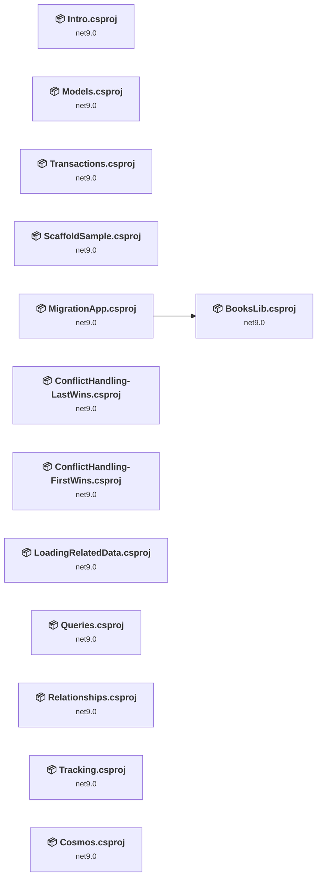

## Project Details

### BooksLib\BooksLib.csproj

#### Project Info

- **Current Target Framework:** net9.0
- **Proposed Target Framework:** net10.0
- **SDK-style**: True
- **Project Kind:** ClassLibrary
- **Dependencies**: 0
- **Dependants**: 1
- **Number of Files**: 7
- **Number of Files with Incidents**: 1
- **Lines of Code**: 225
- **Estimated LOC to modify**: 0+ (at least 0,0% of the project)

#### Dependency Graph

Legend:
📦 SDK-style project
⚙️ Classic project

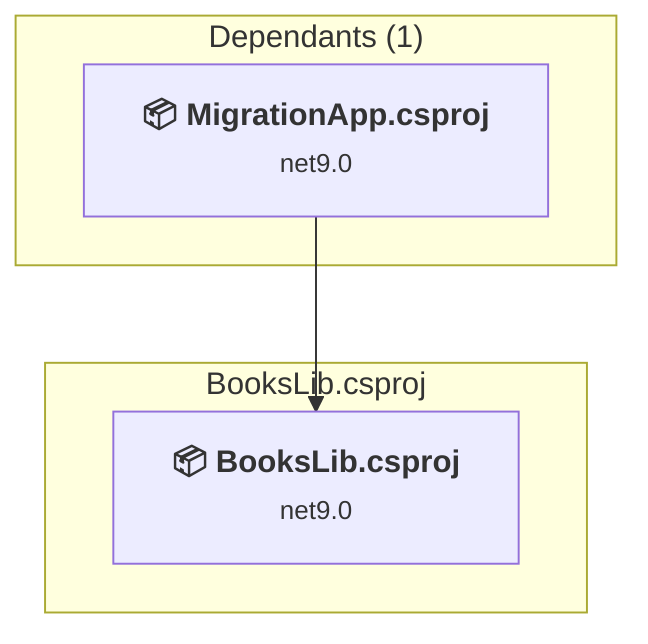

### API Compatibility

| Category | Count | Impact |
| :--- | :---: | :--- |
| 🔴 Binary Incompatible | 0 | High - Require code changes |
| 🟡 Source Incompatible | 0 | Medium - Needs re-compilation and potential conflicting API error fixing |
| 🔵 Behavioral change | 0 | Low - Behavioral changes that may require testing at runtime |
| ✅ Compatible | 245 |  |
| ***Total APIs Analyzed*** | ***245*** |  |

### ConflictHandling-FirstWins\ConflictHandling-FirstWins.csproj

#### Project Info

- **Current Target Framework:** net9.0
- **Proposed Target Framework:** net10.0
- **SDK-style**: True
- **Project Kind:** DotNetCoreApp
- **Dependencies**: 0
- **Dependants**: 0
- **Number of Files**: 5
- **Number of Files with Incidents**: 1
- **Lines of Code**: 176
- **Estimated LOC to modify**: 0+ (at least 0,0% of the project)

#### Dependency Graph

Legend:
📦 SDK-style project
⚙️ Classic project

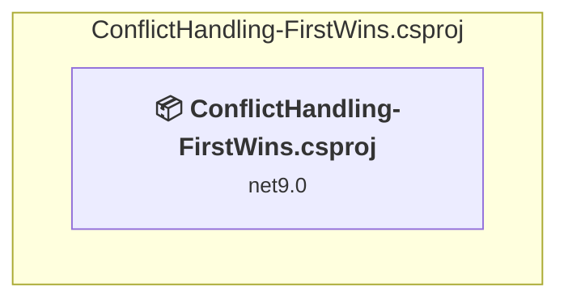

### API Compatibility

| Category | Count | Impact |
| :--- | :---: | :--- |
| 🔴 Binary Incompatible | 0 | High - Require code changes |
| 🟡 Source Incompatible | 0 | Medium - Needs re-compilation and potential conflicting API error fixing |
| 🔵 Behavioral change | 0 | Low - Behavioral changes that may require testing at runtime |
| ✅ Compatible | 256 |  |
| ***Total APIs Analyzed*** | ***256*** |  |

### ConflictHandling-LastWins\ConflictHandling-LastWins.csproj

#### Project Info

- **Current Target Framework:** net9.0
- **Proposed Target Framework:** net10.0
- **SDK-style**: True
- **Project Kind:** DotNetCoreApp
- **Dependencies**: 0
- **Dependants**: 0
- **Number of Files**: 5
- **Number of Files with Incidents**: 1
- **Lines of Code**: 129
- **Estimated LOC to modify**: 0+ (at least 0,0% of the project)

#### Dependency Graph

Legend:
📦 SDK-style project
⚙️ Classic project

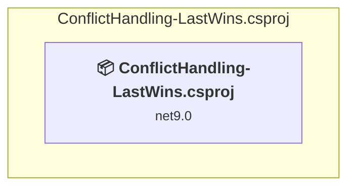

### API Compatibility

| Category | Count | Impact |
| :--- | :---: | :--- |
| 🔴 Binary Incompatible | 0 | High - Require code changes |
| 🟡 Source Incompatible | 0 | Medium - Needs re-compilation and potential conflicting API error fixing |
| 🔵 Behavioral change | 0 | Low - Behavioral changes that may require testing at runtime |
| ✅ Compatible | 191 |  |
| ***Total APIs Analyzed*** | ***191*** |  |

### Cosmos\Cosmos.csproj

#### Project Info

- **Current Target Framework:** net9.0
- **Proposed Target Framework:** net10.0
- **SDK-style**: True
- **Project Kind:** DotNetCoreApp
- **Dependencies**: 0
- **Dependants**: 0
- **Number of Files**: 6
- **Number of Files with Incidents**: 2
- **Lines of Code**: 165
- **Estimated LOC to modify**: 1+ (at least 0,6% of the project)

#### Dependency Graph

Legend:
📦 SDK-style project
⚙️ Classic project

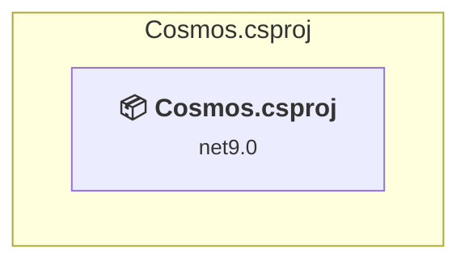

### API Compatibility

| Category | Count | Impact |
| :--- | :---: | :--- |
| 🔴 Binary Incompatible | 1 | High - Require code changes |
| 🟡 Source Incompatible | 0 | Medium - Needs re-compilation and potential conflicting API error fixing |
| 🔵 Behavioral change | 0 | Low - Behavioral changes that may require testing at runtime |
| ✅ Compatible | 251 |  |
| ***Total APIs Analyzed*** | ***252*** |  |

### Intro\Intro.csproj

#### Project Info

- **Current Target Framework:** net9.0
- **Proposed Target Framework:** net10.0
- **SDK-style**: True
- **Project Kind:** DotNetCoreApp
- **Dependencies**: 0
- **Dependants**: 0
- **Number of Files**: 4
- **Number of Files with Incidents**: 1
- **Lines of Code**: 176
- **Estimated LOC to modify**: 0+ (at least 0,0% of the project)

#### Dependency Graph

Legend:
📦 SDK-style project
⚙️ Classic project

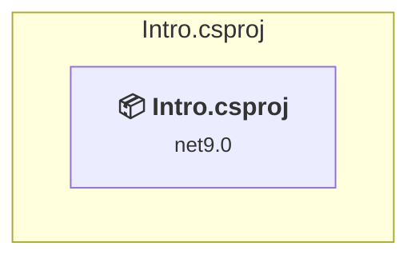

### API Compatibility

| Category | Count | Impact |
| :--- | :---: | :--- |
| 🔴 Binary Incompatible | 0 | High - Require code changes |
| 🟡 Source Incompatible | 0 | Medium - Needs re-compilation and potential conflicting API error fixing |
| 🔵 Behavioral change | 0 | Low - Behavioral changes that may require testing at runtime |
| ✅ Compatible | 214 |  |
| ***Total APIs Analyzed*** | ***214*** |  |

### LoadingRelatedData\LoadingRelatedData.csproj

#### Project Info

- **Current Target Framework:** net9.0
- **Proposed Target Framework:** net10.0
- **SDK-style**: True
- **Project Kind:** DotNetCoreApp
- **Dependencies**: 0
- **Dependants**: 0
- **Number of Files**: 8
- **Number of Files with Incidents**: 1
- **Lines of Code**: 250
- **Estimated LOC to modify**: 0+ (at least 0,0% of the project)

#### Dependency Graph

Legend:
📦 SDK-style project
⚙️ Classic project

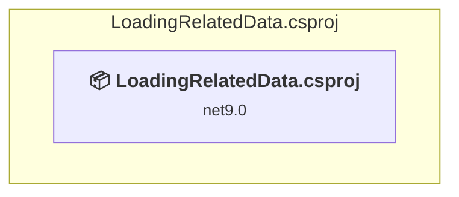

### API Compatibility

| Category | Count | Impact |
| :--- | :---: | :--- |
| 🔴 Binary Incompatible | 0 | High - Require code changes |
| 🟡 Source Incompatible | 0 | Medium - Needs re-compilation and potential conflicting API error fixing |
| 🔵 Behavioral change | 0 | Low - Behavioral changes that may require testing at runtime |
| ✅ Compatible | 421 |  |
| ***Total APIs Analyzed*** | ***421*** |  |

### MigrationApp\MigrationApp.csproj

#### Project Info

- **Current Target Framework:** net9.0
- **Proposed Target Framework:** net10.0
- **SDK-style**: True
- **Project Kind:** DotNetCoreApp
- **Dependencies**: 1
- **Dependants**: 0
- **Number of Files**: 3
- **Number of Files with Incidents**: 1
- **Lines of Code**: 38
- **Estimated LOC to modify**: 0+ (at least 0,0% of the project)

#### Dependency Graph

Legend:
📦 SDK-style project
⚙️ Classic project

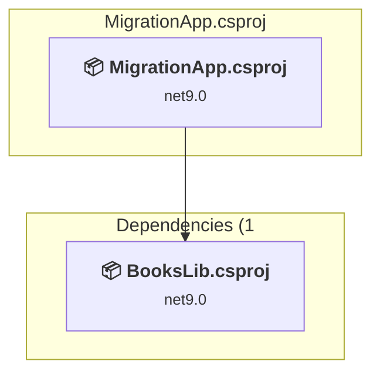

### API Compatibility

| Category | Count | Impact |
| :--- | :---: | :--- |
| 🔴 Binary Incompatible | 0 | High - Require code changes |
| 🟡 Source Incompatible | 0 | Medium - Needs re-compilation and potential conflicting API error fixing |
| 🔵 Behavioral change | 0 | Low - Behavioral changes that may require testing at runtime |
| ✅ Compatible | 45 |  |
| ***Total APIs Analyzed*** | ***45*** |  |

### Models\Models.csproj

#### Project Info

- **Current Target Framework:** net9.0
- **Proposed Target Framework:** net10.0
- **SDK-style**: True
- **Project Kind:** DotNetCoreApp
- **Dependencies**: 0
- **Dependants**: 0
- **Number of Files**: 10
- **Number of Files with Incidents**: 1
- **Lines of Code**: 246
- **Estimated LOC to modify**: 0+ (at least 0,0% of the project)

#### Dependency Graph

Legend:
📦 SDK-style project
⚙️ Classic project

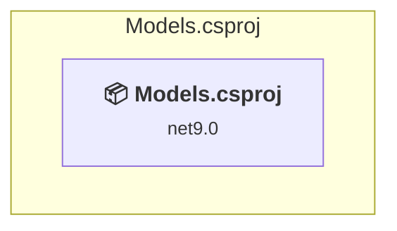

### API Compatibility

| Category | Count | Impact |
| :--- | :---: | :--- |
| 🔴 Binary Incompatible | 0 | High - Require code changes |
| 🟡 Source Incompatible | 0 | Medium - Needs re-compilation and potential conflicting API error fixing |
| 🔵 Behavioral change | 0 | Low - Behavioral changes that may require testing at runtime |
| ✅ Compatible | 358 |  |
| ***Total APIs Analyzed*** | ***358*** |  |

### Queries\Queries.csproj

#### Project Info

- **Current Target Framework:** net9.0
- **Proposed Target Framework:** net10.0
- **SDK-style**: True
- **Project Kind:** DotNetCoreApp
- **Dependencies**: 0
- **Dependants**: 0
- **Number of Files**: 11
- **Number of Files with Incidents**: 1
- **Lines of Code**: 382
- **Estimated LOC to modify**: 0+ (at least 0,0% of the project)

#### Dependency Graph

Legend:
📦 SDK-style project
⚙️ Classic project

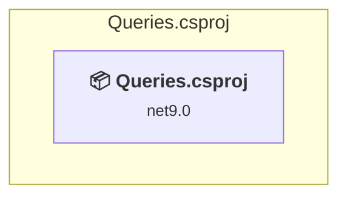

### API Compatibility

| Category | Count | Impact |
| :--- | :---: | :--- |
| 🔴 Binary Incompatible | 0 | High - Require code changes |
| 🟡 Source Incompatible | 0 | Medium - Needs re-compilation and potential conflicting API error fixing |
| 🔵 Behavioral change | 0 | Low - Behavioral changes that may require testing at runtime |
| ✅ Compatible | 573 |  |
| ***Total APIs Analyzed*** | ***573*** |  |

### Relationships\Relationships.csproj

#### Project Info

- **Current Target Framework:** net9.0
- **Proposed Target Framework:** net10.0
- **SDK-style**: True
- **Project Kind:** DotNetCoreApp
- **Dependencies**: 0
- **Dependants**: 0
- **Number of Files**: 23
- **Number of Files with Incidents**: 1
- **Lines of Code**: 1318
- **Estimated LOC to modify**: 0+ (at least 0,0% of the project)

#### Dependency Graph

Legend:
📦 SDK-style project
⚙️ Classic project

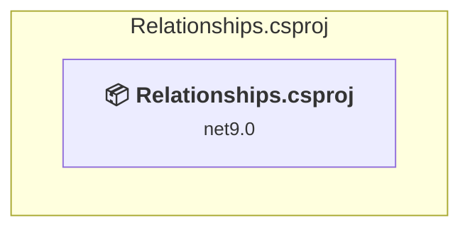

### API Compatibility

| Category | Count | Impact |
| :--- | :---: | :--- |
| 🔴 Binary Incompatible | 0 | High - Require code changes |
| 🟡 Source Incompatible | 0 | Medium - Needs re-compilation and potential conflicting API error fixing |
| 🔵 Behavioral change | 0 | Low - Behavioral changes that may require testing at runtime |
| ✅ Compatible | 1656 |  |
| ***Total APIs Analyzed*** | ***1656*** |  |

### ScaffoldSample\ScaffoldSample.csproj

#### Project Info

- **Current Target Framework:** net9.0
- **Proposed Target Framework:** net10.0
- **SDK-style**: True
- **Project Kind:** DotNetCoreApp
- **Dependencies**: 0
- **Dependants**: 0
- **Number of Files**: 5
- **Number of Files with Incidents**: 1
- **Lines of Code**: 145
- **Estimated LOC to modify**: 0+ (at least 0,0% of the project)

#### Dependency Graph

Legend:
📦 SDK-style project
⚙️ Classic project

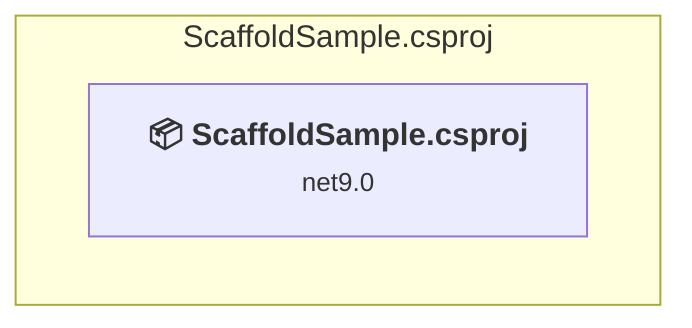

### API Compatibility

| Category | Count | Impact |
| :--- | :---: | :--- |
| 🔴 Binary Incompatible | 0 | High - Require code changes |
| 🟡 Source Incompatible | 0 | Medium - Needs re-compilation and potential conflicting API error fixing |
| 🔵 Behavioral change | 0 | Low - Behavioral changes that may require testing at runtime |
| ✅ Compatible | 169 |  |
| ***Total APIs Analyzed*** | ***169*** |  |

### Tracking\Tracking.csproj

#### Project Info

- **Current Target Framework:** net9.0
- **Proposed Target Framework:** net10.0
- **SDK-style**: True
- **Project Kind:** DotNetCoreApp
- **Dependencies**: 0
- **Dependants**: 0
- **Number of Files**: 10
- **Number of Files with Incidents**: 1
- **Lines of Code**: 375
- **Estimated LOC to modify**: 0+ (at least 0,0% of the project)

#### Dependency Graph

Legend:
📦 SDK-style project
⚙️ Classic project

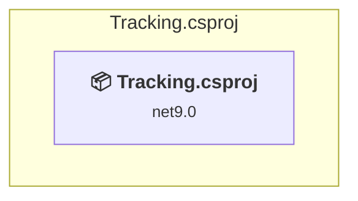

### API Compatibility

| Category | Count | Impact |
| :--- | :---: | :--- |
| 🔴 Binary Incompatible | 0 | High - Require code changes |
| 🟡 Source Incompatible | 0 | Medium - Needs re-compilation and potential conflicting API error fixing |
| 🔵 Behavioral change | 0 | Low - Behavioral changes that may require testing at runtime |
| ✅ Compatible | 433 |  |
| ***Total APIs Analyzed*** | ***433*** |  |

### Transactions\Transactions.csproj

#### Project Info

- **Current Target Framework:** net9.0
- **Proposed Target Framework:** net10.0
- **SDK-style**: True
- **Project Kind:** DotNetCoreApp
- **Dependencies**: 0
- **Dependants**: 0
- **Number of Files**: 11
- **Number of Files with Incidents**: 1
- **Lines of Code**: 368
- **Estimated LOC to modify**: 0+ (at least 0,0% of the project)

#### Dependency Graph

Legend:
📦 SDK-style project
⚙️ Classic project

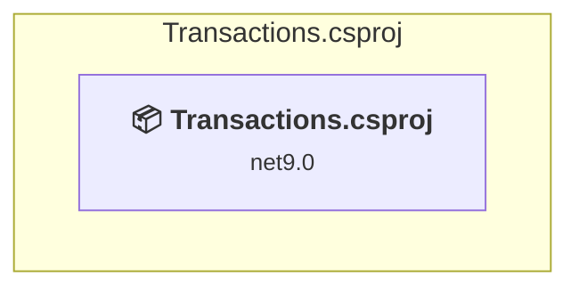

### API Compatibility

| Category | Count | Impact |
| :--- | :---: | :--- |
| 🔴 Binary Incompatible | 0 | High - Require code changes |
| 🟡 Source Incompatible | 0 | Medium - Needs re-compilation and potential conflicting API error fixing |
| 🔵 Behavioral change | 0 | Low - Behavioral changes that may require testing at runtime |
| ✅ Compatible | 530 |  |
| ***Total APIs Analyzed*** | ***530*** |  |

