# Diagrams

## Models

### Owned Entities

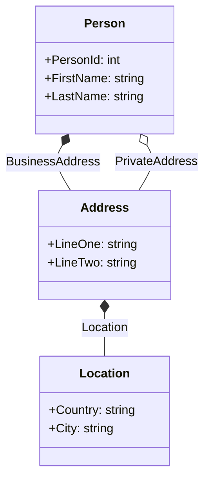

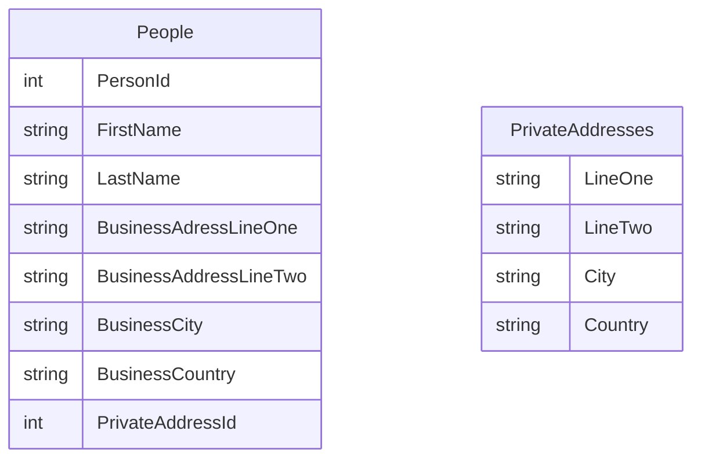

### Table Splitting

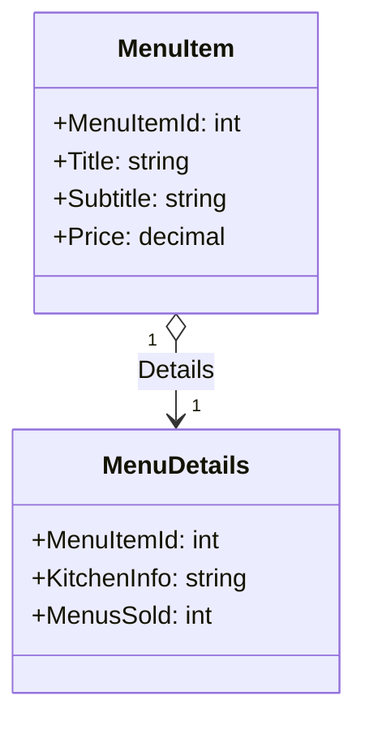

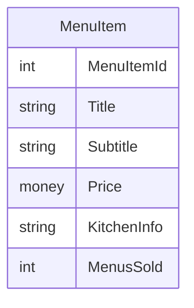

## 

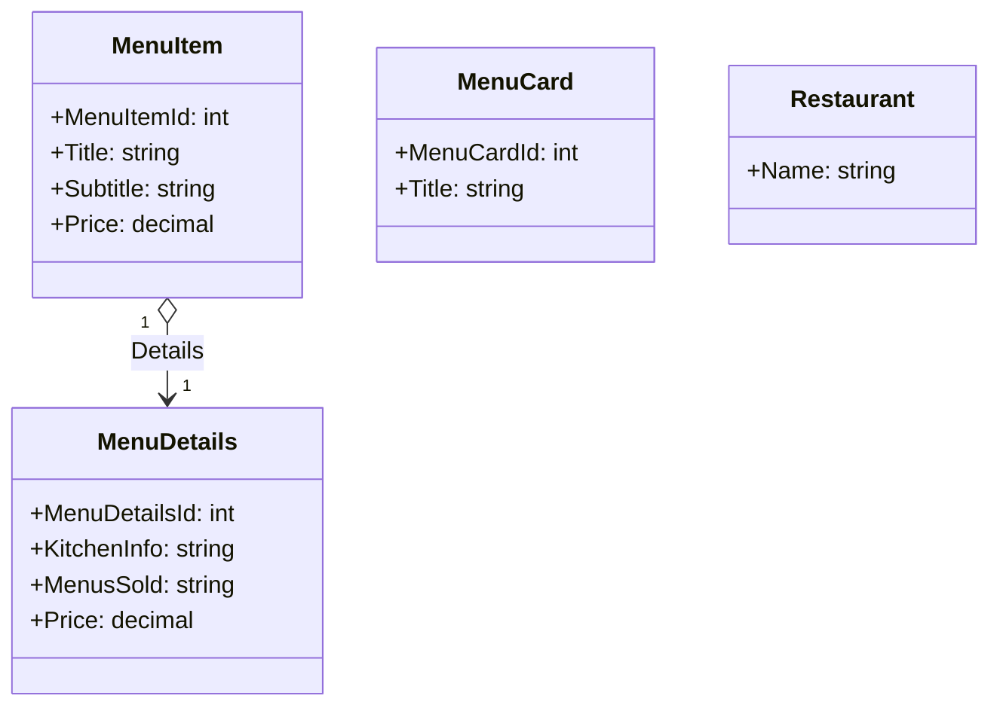

## Inheritance

## Table per Hierarchy (TPH)

TPH is a pattern where you have a base class and multiple derived classes. Each derived class has its own table. The base class table contains a discriminator column that identifies the type of the derived class. The derived class tables contain all the columns of the base class table plus their own columns.

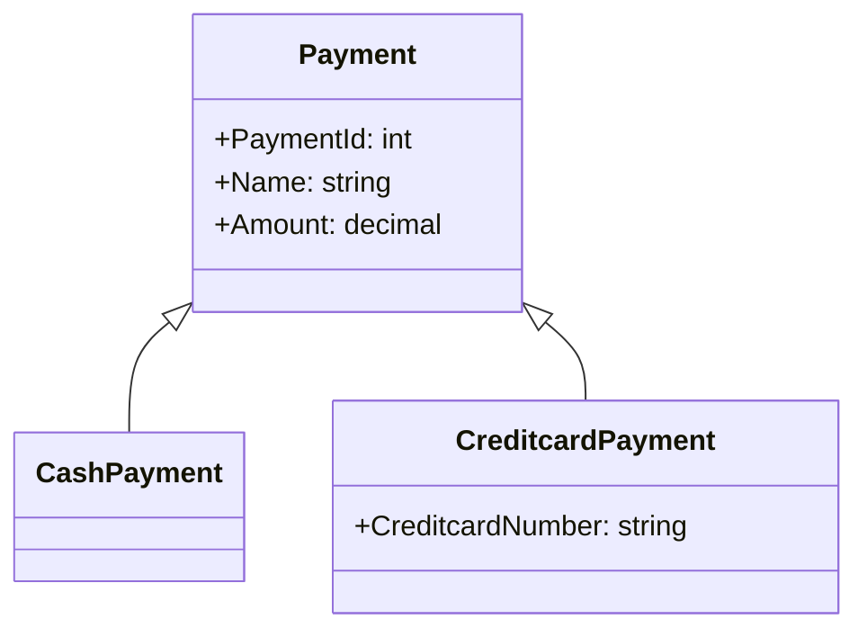

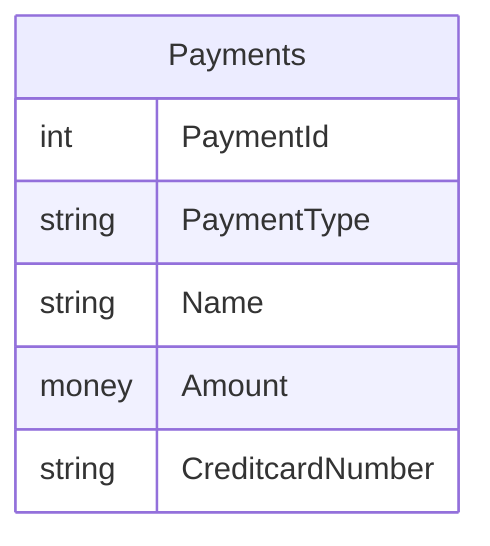

## Table per Type (TpT)

Table per type

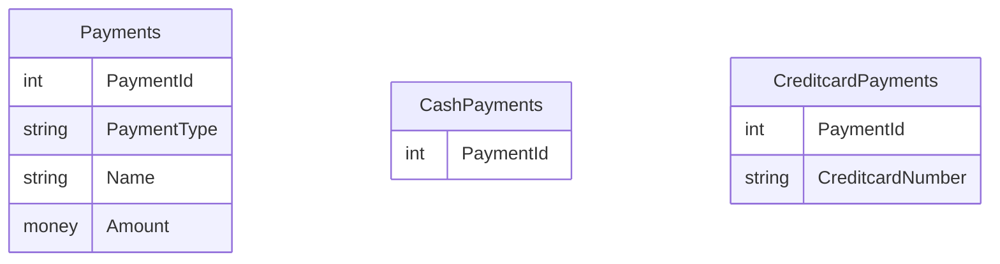

## Table per concrete Type (TcT)

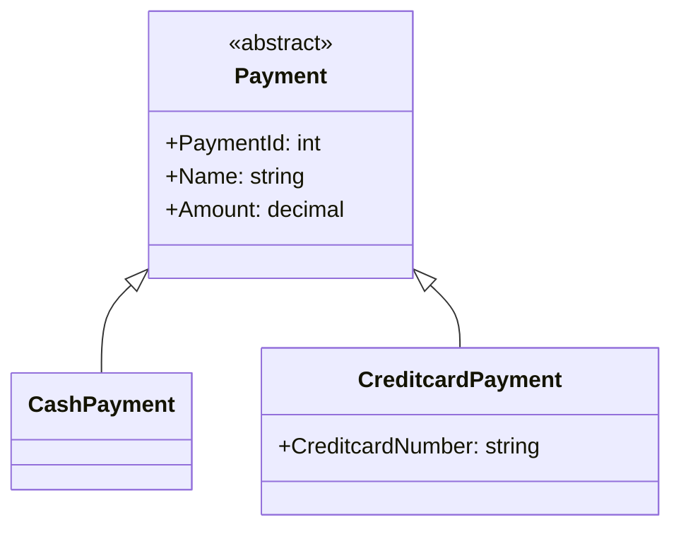
    

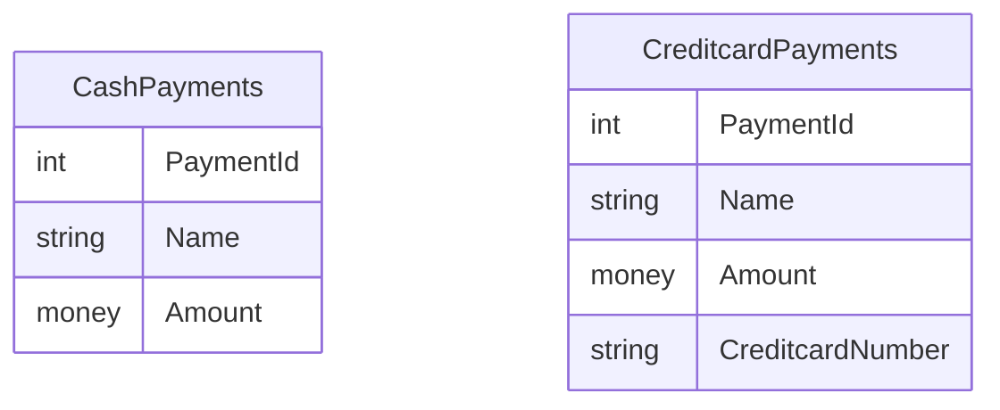

## Many-to-many Relationships

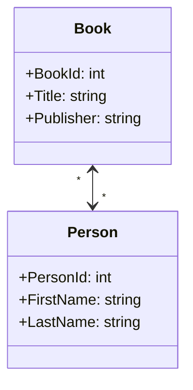

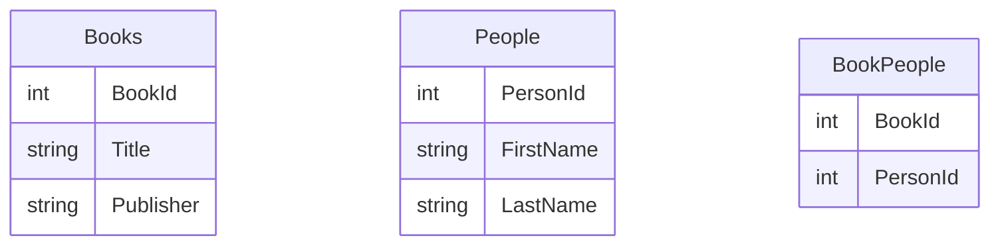