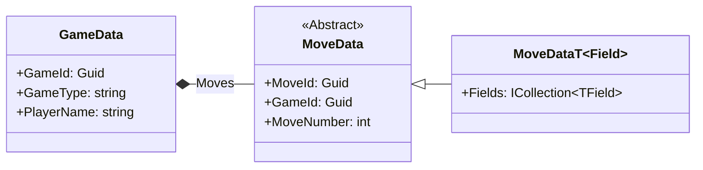
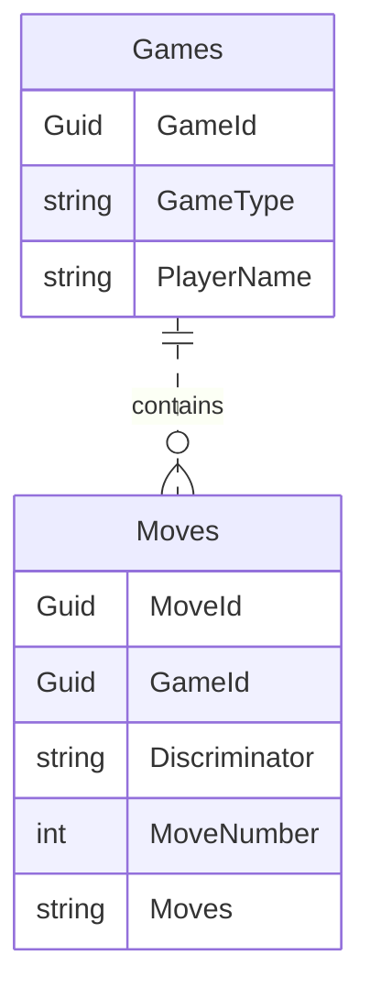

# Diagrams

One-to-many Relationship with Generic Types

## Classes

```mermaid
classDiagram
  direction LR
  GameData *-- MoveData : Moves
  MoveData <|-- MoveDataT~Field~

  class GameData {
    +GameId: Guid
    +GameType: string
    +PlayerName: string
  }
  
  class MoveData {
    <<Abstract>>
    +MoveId: Guid
    +GameId: Guid
    +MoveNumber: int
  }

  class MoveDataT~TField~ {
    +Fields: ICollection~TField~
  }
```

## Tables

```mermaid
erDiagram
  Games ||..o{ Moves : contains

  Games {
    Guid GameId
    string GameType
    string PlayerName
  }

  Moves {
    Guid MoveId
    Guid GameId
    string Discriminator
    int MoveNumber
    string Moves
  }
```